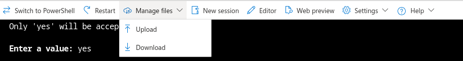
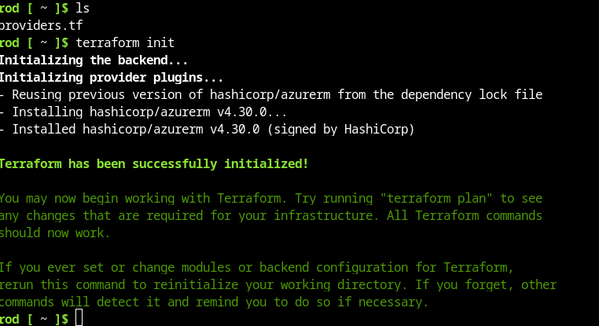
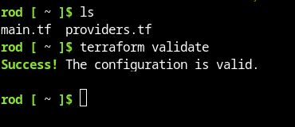
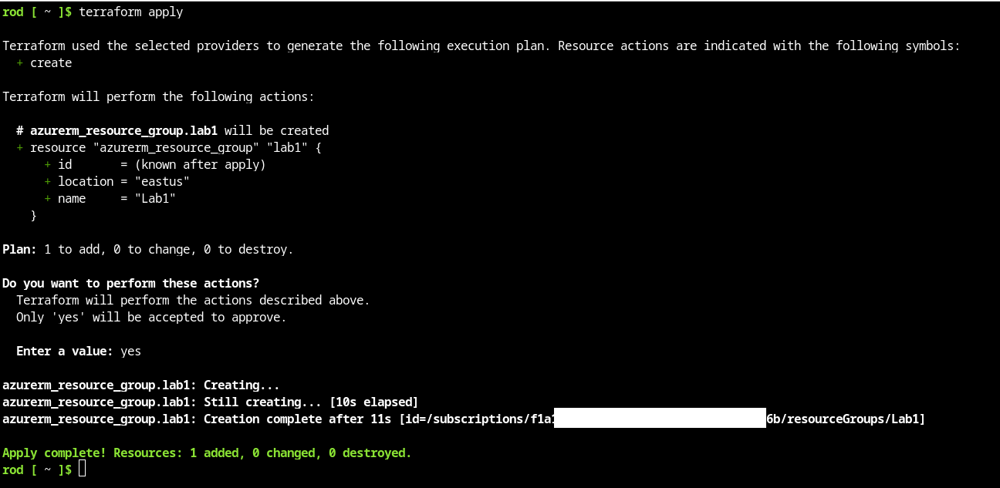
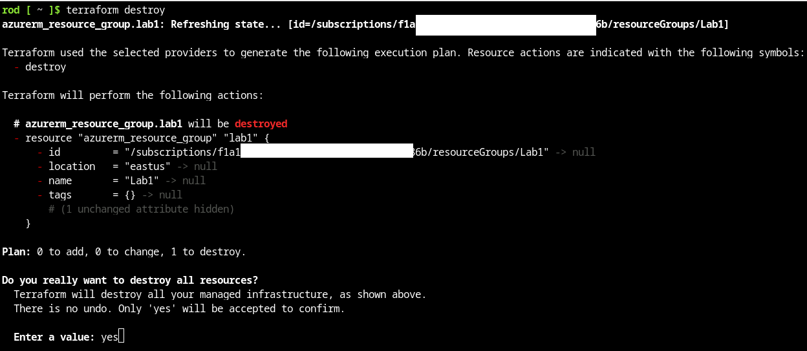
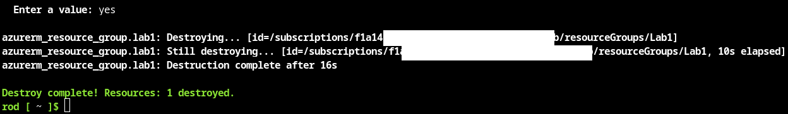

# Lab 01 Setting up

## Part 1: Azure Cloudshell

Instruction on how to do this with the provided accounts will be supplied in a separate file.

## Part 2: Creating the test environment

- Use any text editor you want on your local machine to create the text files specified in the lab.
- Use the file upload option in the file management drop down in the Azure cloud shell environment



### Create the `providers.tf`

- Open the `providers.tf` file in your editor
- Replace the `subscription` placeholder with your own subscription
- Assume your subscription is 1a145f5-f00d-5289-c413-487764d2886b
- Then your file should look like this

```terraform
terraform {
  required_providers {
    azurerm = {
      source  = "hashicorp/azurerm"
    }
  }
}

provider "azurerm" {
  features {}
  subscription_id = "1a145f5-f00d-5289-c413-487764d2886b"
}

```

- Upload the file to the cloudshell and do an `ls` to ensure it is there.

--- 

## Part 2: Initialize Terraform

- Use the `terraform init` command to create the terraform environment.
- It should look something like this:

 


---

## Part 3: Create a test resource group

- Upload the `main.tf` file provided
- It looks like this

```terraform
# Lab 1 test

resource "azurerm_resource_group" "lab1" {
  name     = "Lab1"
  location = "eastus"
}
```

- All this file does is create a resource group.
- Run `terraform validate` to ensure the file parses correctly



- Now run `terraform apply` and answer `yes` to the prompt
- You should see the following output:



- Confirm in the portal GUI that the resource group has been created by 

---

## Part 4: Destroy the resource group

- In the cloudshell, enter the command `terraform destroy` and answer yes to the prompt



- You should see confirmation like this



Check in the GUI to confirm that the resource group has been deleted.# Lab 1 test

resource "azurerm_resource_group" "lab1" {
name     = "Lab1"
location = "eastus"
}

---

## End Lab